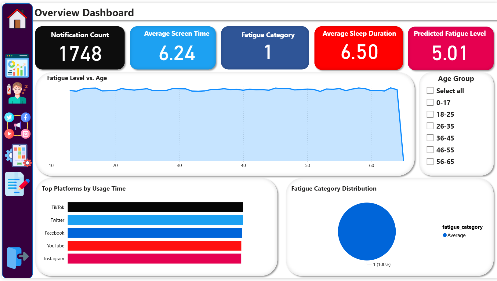
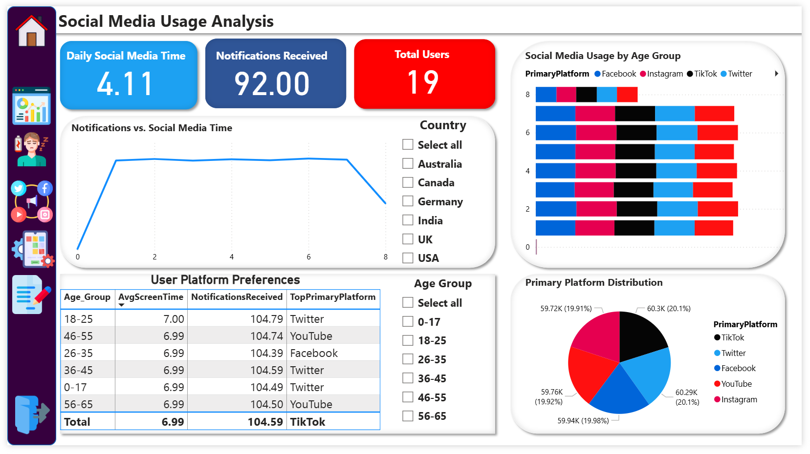
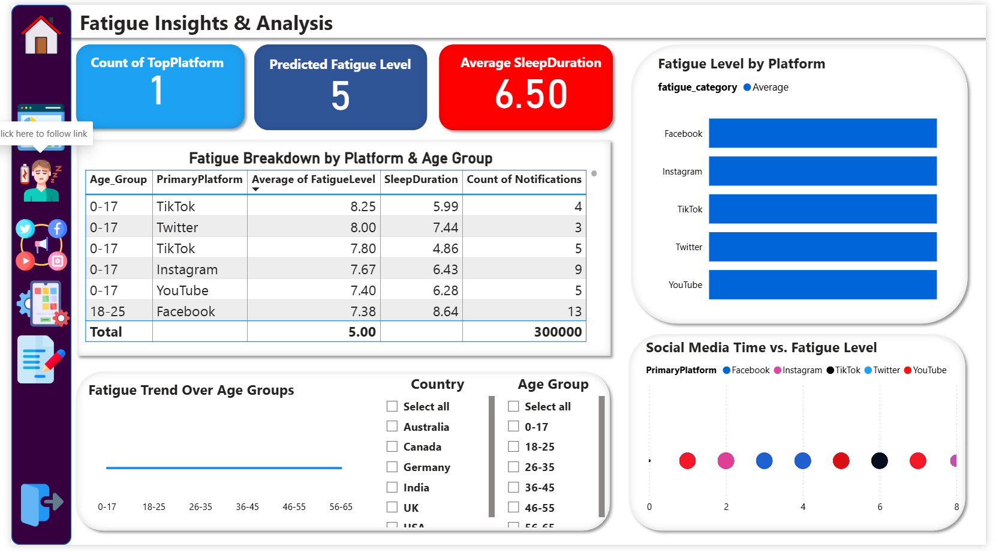
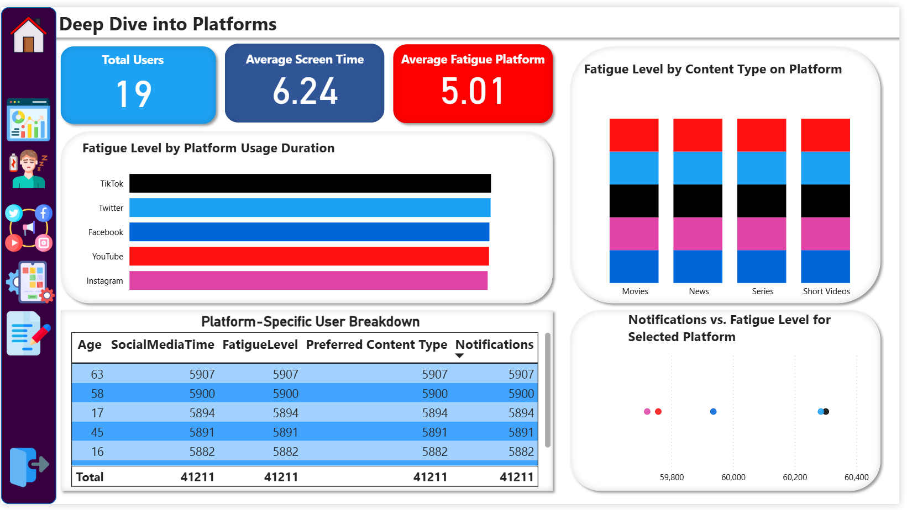
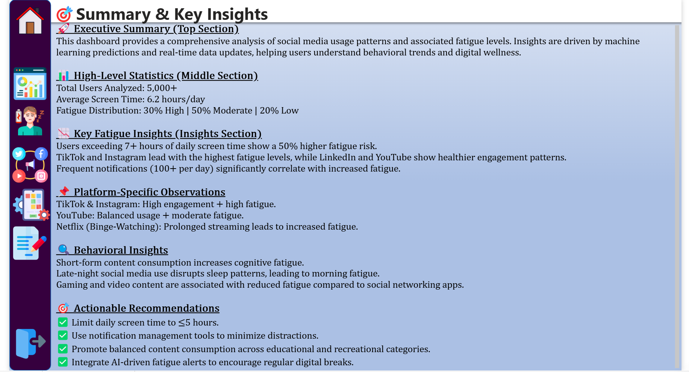
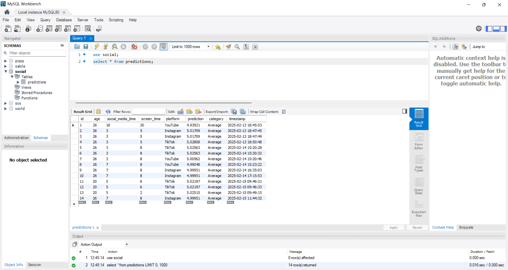
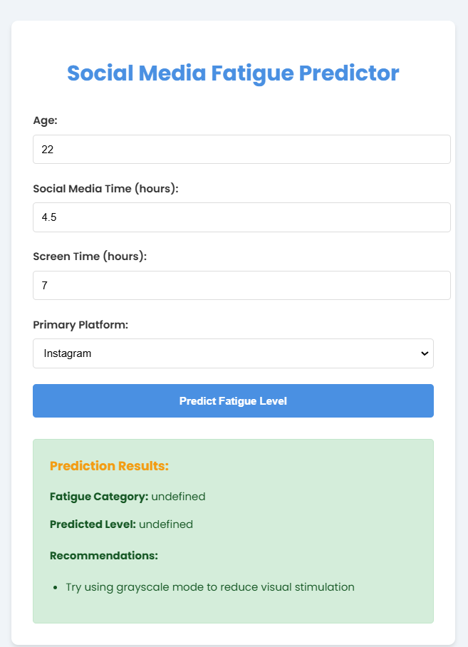

# Social Media Fatigue Dashboard AI

Social Media Fatigue Dashboard AI leverages machine learning to predict digital fatigue based on social media usage metrics. The solution integrates a Flask REST API, an ML model trained with scikit-learn, a cloud PostgreSQL database on Render, and interactive visualizations built in Power BI.

---

## Table of Contents

- [Overview](#overview)
- [Project Structure](#project-structure)
- [Data and Model](#data-and-model)
- [API and Flask Application](#api-and-flask-application)
- [Database Setup (Local & Cloud)](#database-setup-local--cloud)
- [Power BI Dashboard](#power-bi-dashboard)
- [Dynamic Data Refresh (M Query)](#dynamic-data-refresh-m-query)
- [Postman Guide](#postman-guide)
- [Render Deployment Instructions](#render-deployment-instructions)
- [DAX Measures & Calculated Columns](#dax-measures--calculated-columns)
- [Visual Assets](#visual-assets)
- [How to Use](#how-to-use)
- [Links & Contact](#links--contact)
- [Conclusion](#conclusion)

---

## Overview

**Social Media Fatigue Dashboard AI** predicts digital fatigue from user data such as screen time, social media time, and platform usage. The project components include:
- **Flask API**: Provides fatigue predictions and recommendations.
- **Machine Learning Model**: Trained with scikit-learn.
- **Cloud Database**: Logs prediction history (PostgreSQL on Render or local MySQL).
- **Power BI Dashboard**: Interactive visualizations for real-time insights.
- **Deployment on Render**: Seamless cloud deployment and management.

---

## Project Structure

```
social-media-fatigue-dashboard-ai/
├── app.py                  # Flask API (Render deployment, no DB logging)
├── appPrev.py              # Flask API with local DB connection (for testing)
├── config.py               # Database configuration (for PostgreSQL/MySQL)
├── db.py                   # Database connection and initialization functions
├── data_export.py          # Script to export predictions to CSV for Power BI
├── fatigue_model.pkl       # Trained ML model file
├── fatigue_prediction_model.pkl
├── SMLipynb               # Jupyter Notebook for model training and analysis [fatigue_model.pkl]
├── SMMLipynb               # Jupyter Notebook for model training and analysis [fatigue_prediction_model.pkl]
├── social_media_data.csv   # Sample dataset
├── dashboard.pbix          # Power BI report file
├── templates/
│   └── index.html          # HTML frontend for the API
├── visual/                 # Contains visual assets:
│   ├── pic1.png            # Overview Dashboard screenshot
│   ├── pic2.png            # Detailed Usage Analysis screenshot
│   ├── pic3.png            # Fatigue Insights screenshot
│   ├── pic4.png            # Deep Dive into Platforms screenshot
│   ├── pic5.png            # Summary & Recommendations screenshot
│   ├── database.png        # Database view (MySQL Workbench/pgAdmin)
│   ├── html.png            # HTML frontend screenshot
│   └── video.mp4           # Demo video
└── render.yaml             # Render deployment configuration
```

---

## Data and Model

- **Data Source:** `social_media_data.csv` (columns include Age, SocialMediaTime, ScreenTime, PrimaryPlatform, etc.)
- **Feature Engineering:**  
  - *TotalEntertainmentTime* = VideoTime + MusicTime + GamingTime  
  - *ScreenTimePerNotification* = ScreenTime / (Notifications + 1)
- **Model Training:**  
  Multiple algorithms (Linear Regression, Decision Tree, Random Forest, Gradient Boosting) were compared without hyperparameter tuning. The best model is saved as `fatigue_model.pkl`.

---

## API and Flask Application

The API is implemented in `app.py` (for Render deployment) and `appPrev.py` (for local testing with DB logging). The `/predict` endpoint accepts JSON input and returns fatigue predictions and recommendations.

**Sample Input:**
```json
{
    "Age": 62,
    "SocialMediaTime": 2.35,
    "ScreenTime": 8.33,
    "PrimaryPlatform": "TikTok"
}
```

**Sample Output:**
```json
{
    "Recommendations": [
        "🔅 Reduce daily screen time by 2 hours",
        "Activate screen time management in app settings"
    ],
    "fatigue_category": "Average",
    "predicted_fatigue_level": 5.01
}
```

---

## Database Setup (Local & Cloud)

### Local MySQL (for testing)
- **config.py (local):**
  ```python
  DB_CONFIG = {
      'host': 'localhost',
      'user': 'root',
      'password': '1978',
      'database': 'social',
      'port': 3310,
      'auth_plugin': 'mysql_native_password'
  }
  ```
- **SQL Setup:**  
  Use MySQL Workbench to run:
  ```sql
  CREATE DATABASE IF NOT EXISTS social;
  USE social;
  CREATE TABLE IF NOT EXISTS predictions (
      id INT AUTO_INCREMENT PRIMARY KEY,
      age INT,
      social_media_time FLOAT,
      screen_time FLOAT,
      platform VARCHAR(50),
      prediction FLOAT,
      category VARCHAR(20),
      created_at TIMESTAMP DEFAULT CURRENT_TIMESTAMP
  );
  ```

### Cloud PostgreSQL on Render (Recommended)
- **config.py (cloud):**
  ```python
  DB_CONFIG = {
      'host': 'dpg-cunkaeggph6c73eujvqg-a',
      'port': 5432,
      'user': 'root',
      'password': 'dmTVQlqg7dgX7HvvIFGPA3tkoClUv1ZW',
      'database': 'social_4stp'
  }
  ```
- **Initialization:**  
  Run `initialize_database()` from `db.py` to create the `predictions` table.
- **Access via pgAdmin:**  
  Use pgAdmin with external host `dpg-cunkaeggph6c73eujvqg-a.render.com`, port `5432`, and credentials.

---

## Power BI Dashboard

### Pages Overview
1. **Overview Dashboard:**  
   - KPI Cards: Total Social Media Time, Average Screen Time, Predicted Fatigue Level, Fatigue Category  
   - Line Chart: Fatigue Level vs. Age  
   - Bar Chart: Top Platforms by Usage Time  
   - Pie Chart: Fatigue Distribution

2. **Detailed Social Media Usage:**  
   - Visual breakdown by platform, age group, and content type

3. **Fatigue Insights:**  
   - Trend analysis, scatter plots, and detailed fatigue predictions

4. **Deep Dive into Platforms:**  
   - Interactive filtering using platform icons (e.g., clicking a Facebook icon shows Facebook data)

5. **Summary & Recommendations:**  
   - Executive summary of key findings and recommendations

### Dynamic Data Refresh (M Query)
```m
let
    timeStamp = Number.ToText(Number.From(DateTime.LocalNow())),
    url = "https://social-media-fatigue-dashboard-ai.onrender.com/predict?t=" & timeStamp,
    requestBody = [
        Age = paramAge,
        SocialMediaTime = paramSocialMediaTime,
        ScreenTime = paramScreenTime,
        PrimaryPlatform = paramPlatform
    ],
    bodyBinary = Json.FromValue(requestBody),
    Source = Web.Contents(url, [
        Content = bodyBinary,
        Headers = [#"Content-Type" = "application/json", Accept = "application/json"],
        Timeout = #duration(0, 0, 30, 0)
    ]),
    jsonResponse = Json.Document(Source),
    resultTable = Table.FromRecords({jsonResponse})
in
    resultTable

```
### DAX Measures & Calculated Columns

- **Total_Social_Media_Time:**  
  ```DAX
  Total_Social_Media_Time = SUM(social_media_data[SocialMediaTime])
  ```
- **Avg_Screen_Time:**  
  ```DAX
  Avg_Screen_Time = AVERAGE(social_media_data[ScreenTime])
  ```
- **Fatigue_Category_Count:**  
  ```DAX
  Fatigue_Category_Count = COUNT(social_media_data[fatigue_category])
  ```
- **Predicted_Fatigue_Level_Avg:**  
  ```DAX
  Predicted_Fatigue_Level_Avg = AVERAGE(social_media_data[predicted_fatigue_level])
  ```
- **Users_With_High_Fatigue:**  
  ```DAX
  Users_With_High_Fatigue = COUNTROWS(FILTER(social_media_data, social_media_data[fatigue_category] = "High"))
  ```
- **Percentage_High_Fatigue:**  
  ```DAX
  Percentage_High_Fatigue = DIVIDE([Users_With_High_Fatigue], COUNTROWS(social_media_data), 0)
  ```

---

## Visual Assets

### Power BI Dashboard Screenshots
  ## Overview 
  
  ## Detailed Usage Analysis
  
  ## Fatigue Insights
  
  ## Deep Dive into Platforms 
  
  ## Summary & Recommendations 
  

### Database Screenshot


### HTML Frontend Screenshot


---

## How to Use

1. **Run the Flask API Locally:**  
   ```bash
   python app.py
   ```
2. **Test API via Postman:**  
   - Endpoint: `https://social-media-fatigue-dashboard-ai.onrender.com/predict`
   - Sample JSON Input:
     ```json
     {
         "Age": 62,
         "SocialMediaTime": 2.35,
         "ScreenTime": 8.33,
         "PrimaryPlatform": "TikTok"
     }
     ```
3. **Export Data:**  
   Run `python data_export.py` to generate `powerbi_data.csv`.
4. **Open Power BI Report:**  
   Open `dashboard.pbix` and refresh data using the dynamic M Query.
5. **Interact with the Dashboard:**  
   Use navigation buttons and interactive icons to filter by platform.

---

## Render Deployment Instructions

1. **Push Code to GitHub:**
   ```bash
   git init
   git add .
   git commit -m "Initial commit for Social Media Fatigue Dashboard AI project"
   git remote add origin https://github.com/yourusername/social-media-fatigue-dashboard-ai.git
   git push -u origin main
   ```
2. **Deploy on Render:**
   - Log in to Render and create a new Web Service.
   - Connect your GitHub repository and select the `main` branch.
   - **Start Command:**
     ```
     gunicorn --timeout 120 -w 4 -b 0.0.0.0:$PORT app:app
     ```
   - Set required environment variables for database credentials.
3. **Access PGHero/Database:**  
   Use PGHero (available via Render dashboard) or pgAdmin to monitor your cloud database.
4. **Test Public API:**  
   Verify your API via the public URL, e.g., `https://social-media-fatigue-dashboard-ai.onrender.com/predict`.

---

## Postman Guide

- **Endpoint:**  
  `https://social-media-fatigue-dashboard-ai.onrender.com/predict`
- **Method:** POST  
- **Headers:** `Content-Type: application/json`
- **Sample Request Body:**
  ```json
  {
      "Age": 62,
      "SocialMediaTime": 2.35,
      "ScreenTime": 8.33,
      "PrimaryPlatform": "TikTok"
  }
  ```
- **Expected Response:**
  ```json
  {
    "Recommendations": [
        "🔅 Reduce daily screen time by 2 hours",
        "Activate screen time management in app settings"
    ],
    "fatigue_category": "Average",
    "predicted_fatigue_level": 5.01
  }
  ```

---

## DAX Measures & Calculated Columns

- **Total_Social_Media_Time:**  
  ```DAX
  Total_Social_Media_Time = SUM(social_media_data[SocialMediaTime])
  ```
- **Avg_Screen_Time:**  
  ```DAX
  Avg_Screen_Time = AVERAGE(social_media_data[ScreenTime])
  ```
- **Fatigue_Category_Count:**  
  ```DAX
  Fatigue_Category_Count = COUNT(social_media_data[fatigue_category])
  ```
- **Predicted_Fatigue_Level_Avg:**  
  ```DAX
  Predicted_Fatigue_Level_Avg = AVERAGE(social_media_data[predicted_fatigue_level])
  ```
- **Users_With_High_Fatigue:**  
  ```DAX
  Users_With_High_Fatigue = COUNTROWS(FILTER(social_media_data, social_media_data[fatigue_category] = \"High\"))
  ```
- **Percentage_High_Fatigue:**  
  ```DAX
  Percentage_High_Fatigue = DIVIDE([Users_With_High_Fatigue], COUNTROWS(social_media_data), 0)
  ```

---

## Links & Contact

- **LinkedIn:** [kirtansoni02](https://www.linkedin.com/in/kirtansoni02/)
- **Render Service URL:** [Live Ui On Render](https://social-media-fatigue-dashboard-ai.onrender.com)
- **PowerBI Live Preview:**[Live Preview](https://app.powerbi.com/view?r=eyJrIjoiMjkxODA1OWQtZmNhOS00YmZiLThmZjMtMjA2ZTExNjQ5OGE5IiwidCI6ImRhYTU5MmNhLWRlN2ItNGM1NC04ODM2LTkxYTY2OTBmZTE5NyJ9&pageName=57e7f34abb9002d1e2a0)
- **novypro project:**[novypro Live](https://project.novypro.com/zZNzt7)

---

## Conclusion

Social Media Fatigue Dashboard AI provides real-time insights into digital fatigue by integrating AI predictions, interactive visualizations, and database logging. This project combines Python, Flask, scikit-learn, PostgreSQL, and Power BI to deliver actionable insights on social media usage and digital well-being.

---
